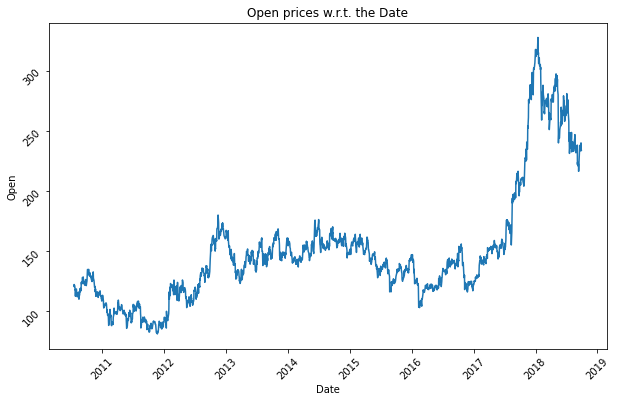
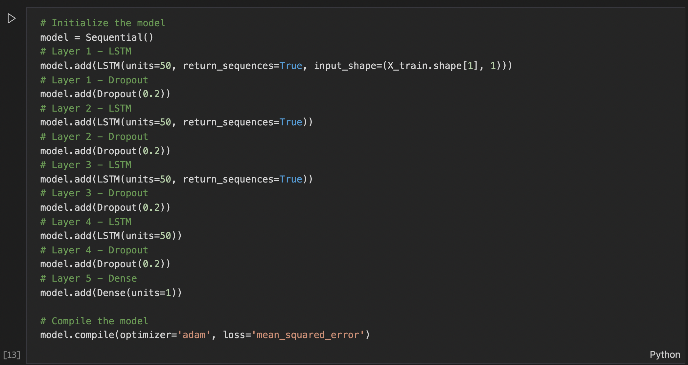
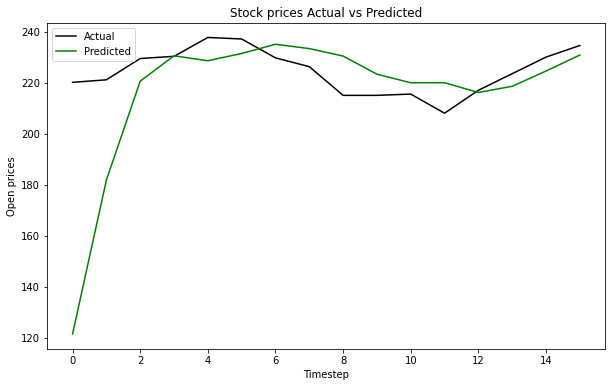

# Stock prices prediction and forecasting using Stacked LSTM

We're given the dataset to analyse and produce a Stacked LSTM model that can forecast stock prices for TATA Global Beverages.

## Dataset

[Dataset](https://raw.githubusercontent.com/mwitiderrick/stockprice/master/NSE-TATAGLOBAL.csv)

Training data is given from 2010-07-21 to 2018-09-28

Columns in the dataset:

- **Date:** Date of the trade
- **Open:** What was the opening price for the share that day
- **High:** What is the highest price of the share that day
- **Low:** What is the lowest value of the stock
- **Last:** What is the last value of the stock
- **Close:** What was the closing price of the stock
- **Total Trade Quantity:** Total trade quantity of stock
- **Turnover (Lacs):** Total turnover for the company

## Approach

Our goal is to forecast "Open" prices for the shares.

- We take "Open" column into the training set.
- Normalize the data
- Convert the data into 60 timesteps and then convert into 3D array
- Create a stacked LSTM model with 4 layers of LSTM + Dropout and then Dense layer
  
- Train the model with training set
- Load testing set
- Normalize the data
- Convert the data into 60 timesteps and then convert into 3D array
- Use the trained model to predict prices
- Plot Actuals vs Predicted prices

